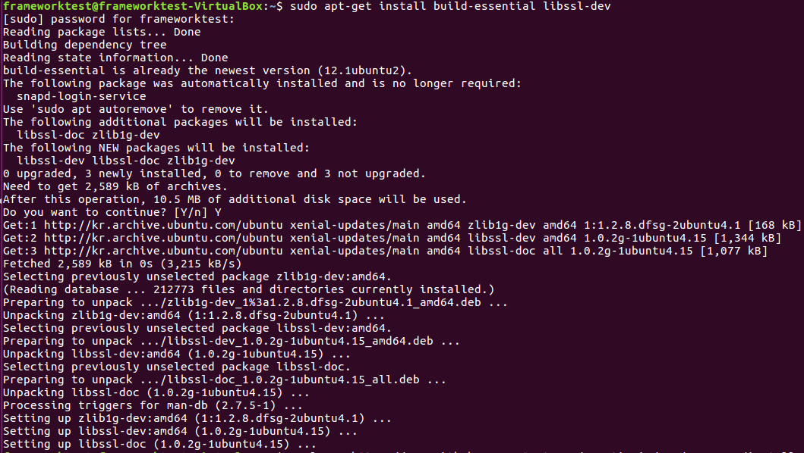

# Development Environment

1. `sudo apt-get install build-essential libssl-dev`

   - 

2. `curl -o- https://raw.githubusercontent.com/creationix/nvm/v0.33.11/install.sh | bash`

   - 

3. `source ~/.bashrc`

   - 

4. `nvm --version`

   1. `> 0.33.11` **check**

   - 

5. `nvm install 10.6.0`

   - 

6. `node --version`

   1. `> 10.6.0` **check**

   - 

7. `npm --version`

   - 
