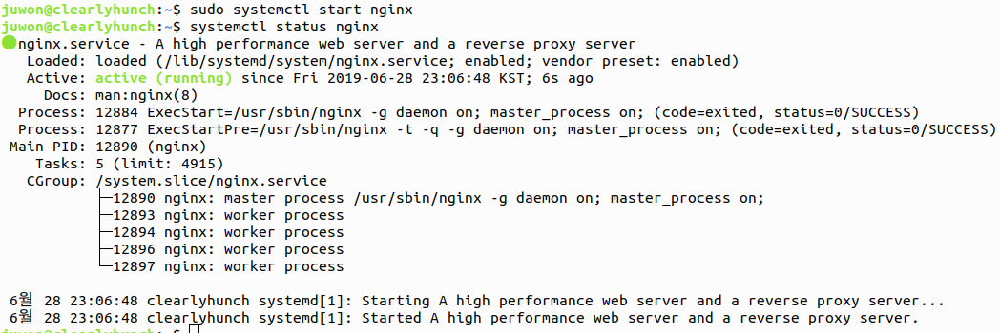

# biometric-data-acquisition-framework

#### The environment is ubuntu 16.04 LTS, npm 6.1.0, and nodejs 10.6.0.

---

## Development Environment (npm, nodeJS)

1. #### `sudo apt-get install build-essential libssl-dev`

   - npm 및 nodejs 관련 모듈을 설치하기 위해, apt로 다음과 같은 모듈을 먼저 설치합니다.

   - libssl-dev 패키지는 SSL 개발에 필요한 라이브러리와 헤더파일등을 가지고 있으며 아래에 링크에 자세한 내용을 살펴 볼수 있습니다.

   - https://packages.debian.org/jessie/libssl-dev

   - 

2. #### `curl -o- https://raw.githubusercontent.com/creationix/nvm/v0.33.11/install.sh | bash`

   - curl을 이용해서 nvm을 설치합니다. (현재 설치하는 버전은 0.33.11입니다.)

   - 

3. #### `source ~/.bashrc`

   - bashrc를 업데이트 합니다.

   - 

4. #### `nvm install 10.6.0`

   - nvm을 10.6.0 버전으로 설치합니다.

   - 

5. #### `nvm --version`

   - ` 0.33.11` version이 맞게 설치되었는지 확인합니다.

   - 

6. #### `node --version`

   1. ` 10.6.0`  version이 맞게 설치되었는지 확인합니다.

   - 

7. #### `npm --version`

   - `6.1.0` version이 맞게 설치되었는지 확인합니다.

   - 

# Development Environment (Android)

1. #### `https://www.jetbrains.com/toolbox/app/?fromMenu` 

   - Download Toolbox APP
   - 

2. #### Save and extract

   - 

     

   - 

3. #### Install Android Studio

   - 

4. #### Run Android Studio

   - `Next` => `standard` => `Next` => `Next` => `Finish` 순서로 순차적으로 선택합니다.

5. #### Setup

   - 

6. `configure` => `AVD Manager` => `Create Virtual Device`

   - Install `Pixel 2` => Download `Pie`

# Error & Version

- `ERROR: Manifest merger failed : Attribute application@appComponentFactory value=(android.support.v4.app.CoreComponentFactory) from [com.android.support:support-compat:28.0.0] AndroidManifest.xm:22:18-91`
  - `gradle.properties`에 아래와 같이 추가하기
    - `android.useAndroidX=true`
    - `android.enableJetifier=true`

- ##### 두번째 빌드부터 발생하는 FileNotFound error
  - 첫 번째 빌드
     - 
  - 두 번째 빌드
     - 
     *실제 환경에서는 해당 오류 발생하지 않음.*
- ##### Spring error  
  - Mysql
    - 
  - Run
    - 
- `gradle 3.1.4 -> 3.4.1 , 1.24.4 -> 1.25.4`
  
  - 
- Module version
  
  - 
- Execute test
  
  - 

# Install Nginx

- #### Install nginx
  
  - 
  - 
- #### Add ufw
  
  - 
- #### Allow permission AVD
  
  - Permission denied
    - 
  - `install qemu-kvm`
    - 
  - Add user kvm
    - `sudo adduser 'user name' kvm`  Use first not second
      - 
  - Permission allow
    - 
    - 
  - After run AVD screenshot
    - 
    - 
    - 

# Install NodeJs

- #### `npm init`
  
  - 
- #### Install modules
  
  - `npm install express`
  - `express-fileupload`
    - 
  - `npm install mysql`
  - `npm install socket.io`
    - 
- #### Run App.js
  
  - 
- #### `localhost:3000/`
  
  - It means index.html
  - 
- #### `localhost:3000/board`
  
  - It means board.html
  - 
