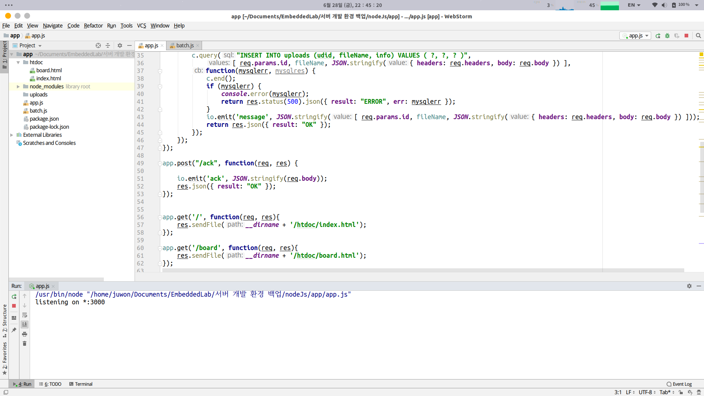

# biometric-data-acquisition-framework

The environment is ubuntu 16.04 LTS, npm 6.1.0, and nodejs 10.6.0.

# Development Environment (npm, nodeJS)

1. `sudo apt-get install build-essential libssl-dev`

   - 

2. `curl -o- https://raw.githubusercontent.com/creationix/nvm/v0.33.11/install.sh | bash`

   - 

3. `source ~/.bashrc`

   - 

4. `nvm --version`

   1. `> 0.33.11` **check**

   - 

5. `nvm install 10.6.0`

   - 

6. `node --version`

   1. `> 10.6.0` **check**

   - 

7. `npm --version`

   - 

# Development Environment (Android)

1. `https://www.jetbrains.com/toolbox/app/?fromMenu` Download Toolbox APP

- 

2. save and extract

   - 

     

   - 

3. install Android Studio

   - 

4. Run Android Studio

   - `Next` => `standard` => `Next` => `Next` => `Finish`

5. Setup

   - 

6. `configure` => `AVD Manager` => `Create Virtual Device

   - Install `Pixel 2` => Download `Pie`

# Error & Version

- `ERROR: Manifest merger failed : Attribute application@appComponentFactory value=(android.support.v4.app.CoreComponentFactory) from [com.android.support:support-compat:28.0.0] AndroidManifest.xm:22:18-91`
  - `gradle.properties`에 아래와 같이 추가하기
    - `android.useAndroidX=true`
    - `android.enableJetifier=true`
- Spring error
  - mysql
    - 
  - run
    - 
- `gradle 3.1.4 -> 3.4.1 , 1.24.4 -> 1.25.4`
  - 
- module Version
  - 
- Execute Test
  - 

# Install Nginx

- install Nginx
  - 
  - 
- add ufw
  - 
- allow permission AVD
  - permission denied
    - 
  - `install qemu-kvm`
    - 
  - add user kvm
    - 
  - permission allow
    - 
    - 
  - after run AVD screenshot
    - 
    - 
    - 

# Install NodeJs

- npm init
  - 
- install modules
  - 
  - 
- run App.js
  - 
- `localhost:3000/`
  - it means index.html
  - 
- `localhost:3000/board`
  - it means board.html
  - 