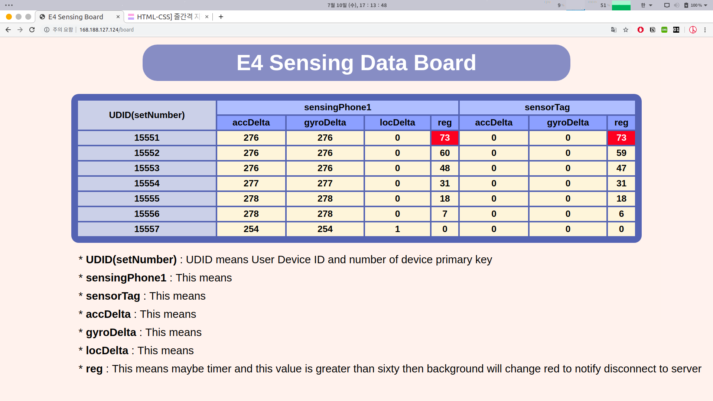

# biometric-data-acquisition-framework

##### The environment is `ubuntu 16.04 LTS`, `npm 6.1.0`,  `nodejs 10.6.0` and `mysql 14.14`


## Development Environment (npm, nodeJS) 

1. ##### `sudo apt-get install build-essential libssl-dev`

   - npm 및 nodejs 관련 모듈을 설치하기 위해, apt로 다음과 같은 모듈을 먼저 설치합니다.

   - libssl-dev 패키지는 SSL 개발에 필요한 라이브러리와 헤더파일등을 가지고 있으며 아래에 링크에 자세한 내용을 살펴 볼수 있습니다.

     > https://packages.debian.org/jessie/libssl-dev

   - 


2. ##### `curl -o- https://raw.githubusercontent.com/creationix/nvm/v0.33.11/install.sh | bash`

   - curl을 이용해서 nvm을 설치합니다. (현재 설치하는 버전은 0.33.11입니다.)
   - 


3. ##### `source ~/.bashrc`

   - bashrc를 업데이트 합니다.
   - 

4. ##### `nvm install 10.6.0`

   - nvm을 10.6.0 버전으로 설치합니다.
   - 

5. ##### `nvm --version`

   - ` 0.33.11` version이 맞게 설치되었는지 확인합니다.
   - 


6. ##### `node --version`

   1. ` 10.6.0`  version이 맞게 설치되었는지 확인합니다.

   - 


7. ##### `npm --version`

   - `6.1.0` version이 맞게 설치되었는지 확인합니다.
   - 


# Development Environment (Android)

1. ##### `https://www.jetbrains.com/toolbox/app/?fromMenu`

   - Ubuntu에서 AndroidStudio를 설치하기위하여 JetBrain의 Toolbox를 활용합니다.
   - 먼저 Toolbox APP의 파일확장자를 .TAR.GZ로 선택하여 다운로드합니다.
   - 


2. ##### Save and extract

   - File을 저장 해야 하므로 Save File을 선택합니다.
   - 
   - 저장한 File은 .tar.gz로 압축되어있습니다.
   - terminal창에서 cd./Downloads를 통해 다운받은 압축파일이 있는곳으로 이동합니다.
   - tar –xvzf [파일명].tar.gz 명령어를 입력하여 파일 압축을 해제합니다.
   - 안에 있는 실행파일을 실행합니다.
   - 

3. ##### Install Android Studio

   - Toolbox APP이 실행시키면 화면에 다운받은수있는 app들 목록이 보여집니다. 그중에서 Android Studio를 찾아 설치합니다.
   - 


4. ##### Run Android Studio

   - `Next` => `standard` => `Next` => `Next` => `Finish` 순서로 순차적으로 선택합니다.


5. ##### Setup

   - 


6. ##### `configure` => `AVD Manager` => `Create Virtual Device`

   - Install `Pixel 2` => Download `Pie`
   - Android Studio를 실행하면 나타나는 화면의 오른쪽 아래에 위치한 configure를 선택합니다. 그리고 위의 순서대로 선택하여 가상머신을 생성합니다.
   - Android Studio에서 project를 연 상태에서는 상단에 위치한 Tools를 선택하면 AVD Manager를 찾을 수 있습니다.


# Error & Version

- ##### 해당 API가 다른 API로 대체되었고 2019년 말에는 사라질 것이라는 내용으로 추후에 해당코드를 수정해야 합니다.

  - 


- ##### `ERROR: Manifest merger failed : Attribute application@appComponentFactory value=(android.support.v4.app.CoreComponentFactory) from [com.android.support:support-compat:28.0.0] AndroidManifest.xm:22:18-91`

  - Gradle Scripts의 `gradle.properties`에 아래와 같이 추가합니다.
    - `android.useAndroidX=true`
    - `android.enableJetifier=true`

- ##### 두번째 빌드부터 발생하는 FileNotFound error

  - 첫 번째 빌드
    - 


  - 두 번째 빌드

  - 

  - 가상머신에서 run할경우 첫번째 빌드는 성공했지만 두번째 빌드에서 오류가 발생하는 경우가 생겼습니다. 아직 이 오류의 원인은 발견하지 못했습니다.
    > *해당 오류는 가상머신에서만 발생하였고 실제 환경에서 이 오류가 발생한적은 없습니다. *


- ##### Spring error  

  - Mysql
  - 


- Run
  
- 
  
- ##### `gradle 3.1.4 -> 3.4.1 , 1.24.4 -> 1.25.4`

  - 


- ##### Module version

  - 

- 


# Install Nginx

- ##### Install nginx

  - Nginx를 설치합니다.  `sudo apt install nginx`
  - 웹서버를 시작시킵니다. `sudo systemctl start nignx`
  - Nginx 상태를 확인합니다. `systemctl status nginx`
  - 
  - 


- ##### Add ufw

   - ufw는 ubuntu의 기본적인 방화벽입니다.
   - `sudo ufw app list`  사용가능한 프로그램을 확인합니다.
    - `sudo ufw allow ‘Nginx HTTP’` 방화벽에서 nginX로 접근을 허용합니다.
  - `sudo ufw status` ufw 상태를 확인합니다.
    - 만약 inactive(비활성화)상태라면 `sudo ufw enable`를 통해 활성화 시킵니다.
    - 


- ##### Allow permission AVD

  - Permission denied
    - Ubuntu에서 가상머신을 실행하면  /dev/kvm에 현재 user가 접근할수없는 오류가 발생합니다.  
    - 


  - `install qemu-kvm`
      - qemu-kvm을 설치합니다.
    - 


  - Add user kvm
    - `sudo adduser 'user name' kvm`  Use first not second
    - `ls –al /dev/kvm`으로 /dev/kvm의 그룹을 확인하면 kvm으로 설정되어있습니다.
    - `grep kvm /etc/group` 명령어를 통해서 kvm user의 정보를 보고 현재 user가 없다면 `sudo adduser [username] kvm` 명령어를 통해서 등록합니다.
      - 


  - Permission allow
    - 가상머신을 다시 실행하면 오류가 발생하지 않음을 확인할 수 있습니다.
    - 
    - 


  - After run AVD screenshot
    - 
    - 
    - 

# Install NodeJs

- ##### `npm init`

  - npm을 만듭니다.
    - 


- ##### Install modules

  - 아래의 명령어를 통해서 필요한 모듈들을 전부 설치합니다.

  - `npm install after array-flatten arraybuffer.slice async-limiter backo2 base64-arraybuffer base64id better-assert bignumber.js blob body-parser busboy bytes callsite component-bind component-emitter component-inherit content-disposition content-type cookie cookie-signature core-util-is debug depd destroy dicer ee-first encodeurl engine.io engine.io-client engine.io-parser escape-html etag express express-fileupload finalhandler forwarded fresh has-binary2 has-cors http-errors iconv-lite indexof inherits ipaddr.js isarray media-typer merge-descriptors methods mime mime-db mime-types ms mysql string_decoder negotiator object-component on-finished parseqs parseuri parseurl path-to-regexp process-nextick-args proxy-addr qs range-parser raw-body readable-stream safe-buffer safer-buffer send serve-static setprototypeof socket.io ms socket.io-adapter socket.io-client socket.io-parser isarray sqlstring statuses streamsearch string_decoder to-array toidentifier type-is unpipe util-deprecate utils-merge vary ws xmlhttprequest-ssl yeast`


  - 


- ##### Run App.js

  - app.js를 실행할 때는 확인은 `node app.js`로 하여도 괜찮으나 서버에서 계속 돌리고자 한다면 `forever start app.js`를 통해서 자동복구할 수 있게끔 돌려야합니다.
  - 


- ##### `localhost:3000/`

  - 기본이 index.html으로 접근됩니다.
  - 


- ##### `localhost:3000/board`

  - `/board` 로 접근할 시 board.html로 연결됩니다.
  - 


## Connect Virtual Machine Web Server

- ##### 가상머신 웹서버로 nginx를 설치하였습니다.

- ##### `파일` => `호스트 네트워크 관리자 (ctrl + h)` 로 아래 화면을 설정합니다.

  - ##### 없다면 새로 만들기

  - 수동으로 어댑터 설정

  - IPv4 주소 : `192.168.56.1`

  - IPv4 서브넷 마스크 : `255.255.255.0`

    - 


- ##### DHCP서버를 선택합니다.

  - 서버주소 : `192.168.56.100`
  - 서버 마스크 : `255.255.0`
  - 최저 주소 한계 : `192.168.56.101`
  - 최고 주소 한계 : `192.168.56.254`
    - 


- ##### 해당 가상머신의 `설정` => `네트워크` =>`어댑터`를 아래와 같이 설정합니다.

  - `어댑터 1`은 `NAT`로 사용하고 있을 것입니다.
  - 그래서 저희는 `어댑터2`를 사용하겠습니다.
  - `다음에 연결됨`을 `호스트 전용 어댑터`로 설정합니다.
    - 


  - 가상머신을 재부팅하고 주소를 확인하면 `192.168.56.102`라고 DHCP를 통해서 ip주소가 자동할당된 것을 확인할 수 있습니다.
    - 


  - 이 주소는 local 서버의 경우이니 실제 환경에서는 고정시켜서 사용합니다.

    - 가상머신의 ip주소를 고정시키는 방법은 다음 주소를 참고하였습니다. *(추후에 수정)*

      > https://dbrang.tistory.com/1279

  - `http://192.168.56.102`를 통해서 가상머신의 웹서버 nginx에 접속되는 것을 확인할 수 있었습니다.

  - 


## Connect App

- ##### 안드로이드 어플과 웹서버를 public ip `168.188.127.124`를 통해서 80번 포트로 연결한 뒤 3000포트로 포트포워딩하였습니다.

- ##### 스마트폰에서 센서를 통해서 수집한 데이터를 logcat으로 확인하였습니다.

  - 

- ##### 수집한 정보를 웹서버를 통해서 접근한 모습입니다.

  - 접근 후 시간이 일정시간 이상 경과시 **붉은 색**으로 접근이 끊겼음을 표시합니다.

    > 해당 부분은 추후에 자동 복구를 할 수 있게 수정이 필요합니다.

    - 
    - 
    
    
    
    > 우선 변경한  css 이미지로서 추후에 수정하기
    
    - 


## Install Mysql

- ##### ` sudo apt install mysql-server` 를 통해서 mysql-server를 설치합니다.

  - 설치중에 Mysql에서 사용할 root용 `password 설정`을 합니다.

    > 우선은 `Rootpass12#$`으로 설정을 해두었습니다. ( 추후에 강력하게 변경하기 )    
    > *시작시 `sudo` 조건 안주고 접근시 실행불가*


  - password를 잊어버리더라도 Google에 `mysql password forgot`와 같은 방식으로 검색하면 방법이 있습니다.
  - 


- ##### `sudo apt install mysql-workbench` 를 통해서 mysql-workbench를 설치합니다.

  - 


- ##### `sudo service mysql start`

  - 


- ##### mysql의 ufw를 등록합니다.

  - 


- ##### workbench를 통해서 mysql DB에 접근합니다.

  - 접근하기 전에 3306포트에 대한 접근권한을 줍니다.
  - 


- ##### `/upload`/를 통해서 접근할 시에는 3306포트로 nginx에서 포워딩해줍니다.

  - 


## Make Mysql DB (uploads, logs)

- 우선 `main` DB를  만듭니다.

  - `CREATE DATABASE main;`


- ##### 아래의 명령어를 통해서 `uploads`와 `logs` table을 생성합니다.

  - ```mysql
    CREATE TABLE uploads(
            id INT(11) NOT NULL PRIMARY KEY AUTO_INCREMENT,
            udid VARCHAR(255) NOT NULL, fileName VARCHAR(255) NOT NULL,
            info LONGTEXT,
            reg TIMESTAMP ON UPDATE CURRENT_TIMESTAMP NOT NULL DEFAULT CURRENT_TIMESTAMP,
            processed INT(11) NOT NULL DEFAULT 0
        );
    CREATE TABLE logs(
        id BIGINT(20) NOT NULL PRIMARY KEY AUTO_INCREMENT,
        fileID BIGINT(20), json VARCHAR(255),
        logID BIGINT(20), reg BIGINT(20) NOT NULL,
        type VARCHAR(255)
    );
    ```


- `DESC uploads`를 통해서 생성된 **uploads table**을 확인할 수 있습니다.
  - 

- `DESC logs`를 통해서 생성된 **logs table**을 확인할 수 있습니다.
  - 
