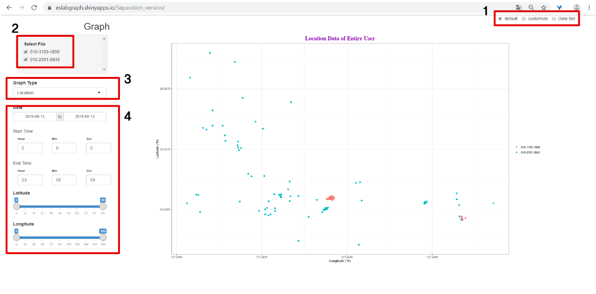
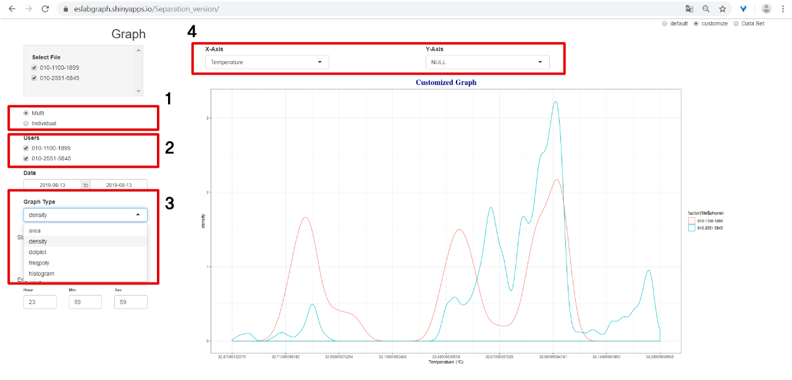
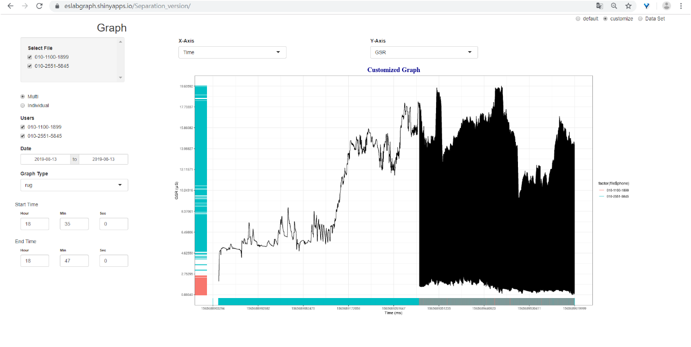
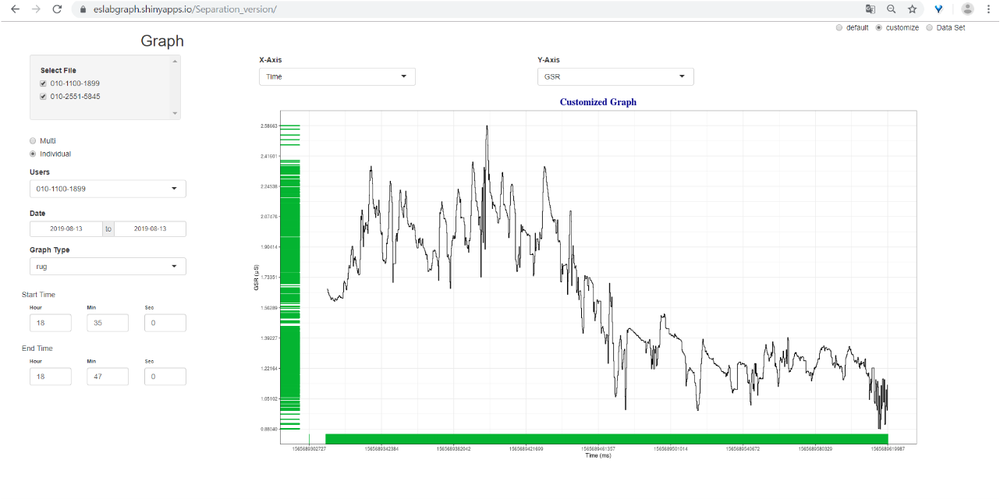
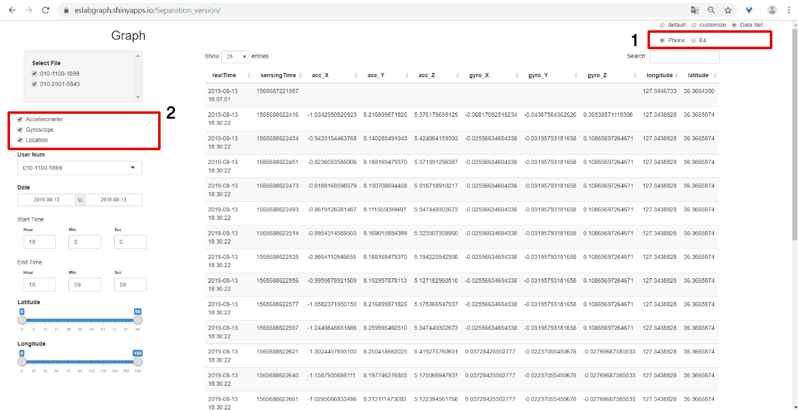

## Manual of Graph

그래프 URL 
> [https://eslabgraph.shinyapps.io/Separation_version/](https://eslabgraph.shinyapps.io/Separation_version/)

### default 
위 URL에 처음 접속 시 보이는 화면은 아래와 같습니다.

 - default, customize, Data set 모드가 있습니다. 
> 위 default 모드에서는Location 데이터를 제외한 나머지 데이터들은 line으로 그려지며, Location은 point로 나타냈습니다.
 -  센싱 데이터는 유저의 핸드폰 번호 별 폴더 속 날짜에 따라 저장됩니다. 핸드폰 번호 형식의 파일명을 체크하면 해당 파일 속 모든 Phone.csv, E4.csv 파일을 읽어옵니다. (첫 접속 시에는 모든 파일이 선택됩니다.)
 - Graph Type은 어떤 데이터를 그래프로 보여질 것인지 선택하는 것입니다. *Location, Accelerometer, Gyroscope, Temperature, Inter Beat Interval, GSR, Blood Volume Pulse* 가 있습니다.  
> 위 Location 그래프는 경도와 위도를 각각 x축 y축으로 한 후, 모든 유저의 데이터들에 대해 point로 나타냈고 각 유저별로 point의 색을 다르게 표시하였습니다. Location을 제외한 나머지는 유저 한명에 대한 그래프가 보여집니다. 
 - Data와 Longitude, Latitude,는 데이터들을 필터링을 합니다. 

 ### customiz
 

 - Multi와 Individual 모드가 있습니다. Multi는 선택된 모든 유저의 데이터를 같이 보여주며, Individual은 유저를 한명 선택하여 한명에 대한 데이터를 그래프로 보여줍니다.
 - Multi 모드일 경우 유저는 checkbox로 선택할 수 있습니다.
 - Graph Type을 직접 선택할 수 있습니다. variable이 한 개인지,  두 개인지에 따라 선택할 수 있는 Graph Type은 달라집니다.
 

> Y-Axis에 NULL을 선택할 경우, 선택한 X-Axis 데이터의 빈도에 따라 그려집니다. 이 때 선택할 수 있는 Graph Type은  *area, density, dotplot, freqpoly, histogram* 입니다.

> Y-Axis가 NULL이 아닐 경우, X-Axis에 따라 데이터를 정렬하여 X-Axis에 따른 Y-Axis로 그래프가 그려집니다. 이 때 선택할 수 있는 Graph Type은 *line, step, point, smooth, text, label, jitter, rug* 가 있습니다.

 - X-Axis와 Y-Axis를 직접 선택할 수 있습니다. Y-Axis에는 NULL을 추가하여 데이터 빈도에 따른 그래프도 그릴 수 있습니다.

### **customize 주의 사항**
직접 x축과 y축을 선택하여 그래프를 그리는 것이니만큼 때로는 이상한 그래프가 보여질 수 있습니다. 

> 아래 예시로는 Multi 모드에서 rug를 통해 그래프를 그린 것입니다. rug는 데이터의 밀도를 확인하기 위한 것으로, 이를 Multi 모드로 그릴 경우 선의 색상이 달라 밀도를 제대로 확인할 수 없습니다.

### Data Set

 - Phone 모드와 E4 모드가 있습니다. 각각 Phone에서 센싱한 데이터와 E4 센서에서 센싱한 데이터 테이블을 볼 수 있습니다.
 - 테이블의 열을 checkbox를 통해 선택할 수 있습니다. 

